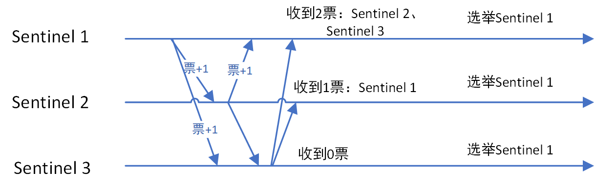
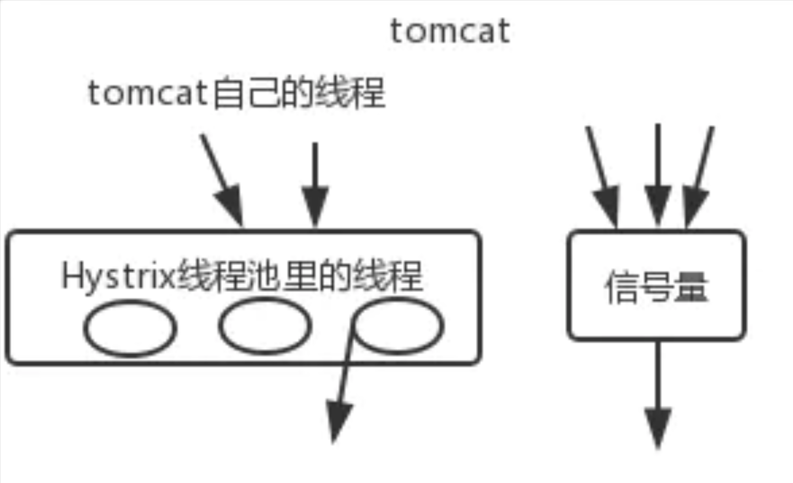

# Java技能树库

## 目录

<!--ts-->
  * [Java](#java)
    * [多线程、JUC](#多线程juc)
      * [happens-before原则](#happens-before原则)
      * [锁](#锁)
          * [sychronized原理与对象锁](#sychronized原理与对象锁)
          * [AQS](#aqs)
          * [ReentrantLock](#reentrantlock)
          * [ReentrantReadWriteLock](#reentrantreadwritelock)
          * [StampedLock](#stampedlock)
      * [多线程面试题总结](#多线程面试题总结)
      * [线程池](#线程池)
      * [线程数](#线程数)
      * [工具类](#工具类)
    * [集合](#集合)
      * [普通集合](#普通集合)
          * [ArrayList](#arraylist)
          * [HashMap](#hashmap)
      * [JUC中集合](#juc中集合)
          * [ConcurrentHashMap](#concurrenthashmap)
          * [CopyOnWriteList](#copyonwritelist)
          * [ThreadLocal](#threadlocal)
          * [ArrayBlockingQueue与LinkedBlockingQueue的差别](#arrayblockingqueue与linkedblockingqueue的差别)
    * [JVM](#jvm)
      * [GC](#gc)
          * [内存划分](#内存划分)
          * [GCROOT](#gcroot)
          * [GC算法](#gc算法)
          * [对象什么时候进入老年代](#对象什么时候进入老年代)
          * [G1](#g1)
      * [类加载](#类加载)
    * [NIO](#nio)
* [框架](#框架)
    * [Spring](#spring)
      * [IOC](#ioc)
          * [IOC容器启动过程——AbstractApplicationContext.refresh()](#ioc容器启动过程abstractapplicationcontextrefresh)
            * [1.prepareRefresh() 准备工作，设置启动状态，处理配置文件占位符等](#1preparerefresh-准备工作设置启动状态处理配置文件占位符等)
            * [2.obtainFreshBeanFactory() 将需要的Bean解析成BeanDefinition并注册到BeanFactory中](#2obtainfreshbeanfactory-将需要的bean解析成beandefinition并注册到beanfactory中)
            * [3.prepareBeanFactory(beanFactory) 准备BeanFactory](#3preparebeanfactorybeanfactory-准备beanfactory)
            * [4.postProcessBeanFactory(beanFactory) 在注册了所有Bean之后，PostBeanProcessor注册前预留的拓展点（模板方法）](#4postprocessbeanfactorybeanfactory-在注册了所有bean之后postbeanprocessor注册前预留的拓展点模板方法)
            * [5.invokeBeanFactoryPostProcessors(beanFactory) 调用所有的BeanFactoryPostProcessors.postProcessBeanFactory](#5invokebeanfactorypostprocessorsbeanfactory-调用所有的beanfactorypostprocessorspostprocessbeanfactory)
            * [6.registerBeanPostProcessors(beanFactory) 注册ProcessBeanProcessor](#6registerbeanpostprocessorsbeanfactory-注册processbeanprocessor)
            * [7.initMessageSource() 处理国际化资源](#7initmessagesource-处理国际化资源)
            * [8.initApplicationEventMulticaster() 初始化事件广播](#8initapplicationeventmulticaster-初始化事件广播)
            * [9.onRefresh() 初始化bean之前的预留的拓展点（模板方法）](#9onrefresh-初始化bean之前的预留的拓展点模板方法)
            * [10.registerListeners() 检查和注册事件监听器](#10registerlisteners-检查和注册事件监听器)
            * [11.finishBeanFactoryInitialization(beanFactory) 初始化所有的非懒加载单例](#11finishbeanfactoryinitializationbeanfactory-初始化所有的非懒加载单例)
            * [12.finishRefresh() 广播初始化完成事件](#12finishrefresh-广播初始化完成事件)
      * [AOP](#aop)
      * [SpringMVC](#springmvc)
      * [SpringCloud](#springcloud)
      * [Spring中的各类BeanPostProcessor](#spring中的各类beanpostprocessor)
    * [RocketMQ](#rocketmq)
    * [Tomcat](#tomcat)
    * [Netty](#netty)
    * [Redis](#redis)
          * [高可用和哨兵机制](#高可用和哨兵机制)
* [数据库](#数据库)
    * [MySQL](#mysql)
      * [单表理想性能计算](#单表理想性能计算)
      * [索引（InnoDB）](#索引innodb)
      * [事务特性 ACID](#事务特性-acid)
      * [事务隔离级别](#事务隔离级别)
      * [锁](#锁-1)
          * [锁的种类](#锁的种类)
          * [锁的算法](#锁的算法)
            * [Record Lcok](#record-lcok)
            * [Gap Lock](#gap-lock)
            * [Next-Key Lock](#next-key-lock)
          * [死锁](#死锁)
    * [MongoDB/ElasticSearch/HBase设计原理](#mongodbelasticsearchhbase设计原理)
* [常用设计模式](#常用设计模式)
* [网络](#网络)
    * [三次握手四次挥手](#三次握手四次挥手)
* [数据结构](#数据结构)
* [其他](#其他)
    * [引用](#引用)
    * [CPU load和使用率的关系](#cpu-load和使用率的关系)
    * [分布式系统设计原则：CAP原则](#分布式系统设计原则cap原则)
    * [分布式事务](#分布式事务)
    * [Java字节码增强探秘](#java字节码增强探秘)
* [汇总](#汇总)

<!-- Added by: elinzhou, at: 2020年 1月15日 星期三 16时26分22秒 CST -->

<!--te-->
## Java 

### 多线程、JUC

#### happens-before原则

- 程序顺序规则：一个线程中的某个操作happens-before于后续的操作（如果调转前后的操作后不会改变程序结构，那么这写操作仍可被指令重排）
- 监视器锁规则：解锁操作前的操作happens-before于之后的上锁操作（及其上锁后的操作）（一般认为的synchronized锁范围内变量的可见性是通过这条规则实现的）
- volatile变量规则：volatile变量的写操作happens-before于后续对这个变量的读操作（即保证了volatile关键字修饰变量的可见性）
- 传递性：A happens-before B，B happens-before C ，那么A happens-before C
- start()规则：执行Thread.start()前的操作happends-before 于start()启动的线程中执行的操作（即被启动的线程中可以看到启动前的操作）
- join()规则：A线程中执行B.join()，那么B线程中的操作happens-before于join()返回后的操作
- 程序中断规则：对线程interrupt()方法的调用happens-before后续被中断线程中的检测操作
- finalize规则：对象的初始化操作happens-before finalize中的操作


#### 锁

##### sychronized原理与对象锁

https://juejin.im/post/5ae6dc04f265da0ba351d3ff

* 锁状态：锁可以升级但不能降级
  * 无锁状态
  * 偏向锁状态：记录第一个获得锁对象的id，如果之后该线程尝试获得锁，就直接放行；如果其他线程尝试获取锁，则判断对象头中记录（持有锁）的线程是否存活，如果不存活则设置为无锁状态，如果存活则判断线程中的锁记录决定撤销锁/偏向到当前线程/升级锁状态
  * 轻量级锁状态：线程通过CAS将锁对象中的Markword替换成当前对象头中MarkWord，替换成功则执行同步块，如果替换失败，说明存在锁竞争，则自旋，自旋获取仍失败时，修改标记位为重量级锁；执行完同步块需要释放锁的线程同样适用CAS修改Markword，此时发现锁被升级，需要释放锁并唤醒其他等待锁的线程
  * 重量级锁状态：在代码块前后增加monitorenter和monitorexit

##### AQS

https://juejin.im/post/5aeb07ab6fb9a07ac36350c8

##### ReentrantLock

https://juejin.im/post/5aeb0a8b518825673a2066f0 

* 公平锁与非公平锁的差别是公平锁在请求锁时判断AQS中当前节点是否有前驱节点，如果有，说明有更早的线程在等待锁

#####  ReentrantReadWriteLock

https://juejin.im/post/5aeb0e016fb9a07ab7740d90

* 读锁是共享锁，写锁是独占锁
* 读写锁个数保存方式：读锁个数保存在高16位，写锁保存在低16位

##### StampedLock

包含三个概念：写锁、乐观读、读锁。其中读锁和写锁等同于ReentrantReadWriteLock，乐观读相当于数据库中的乐观锁，在读完后判断版本号（stamp）是否过期，如果过期了，就升级为读锁。在多读少写的场景下，性能更胜于ReentrantReadWriteLock。该锁的非可中断方法对中断的响应有bug，会导致CPU100%，如果有响应中断的需求，需要使用可响应中断的方式获取锁。

#### 多线程面试题总结

http://www.cnblogs.com/xrq730/p/5060921.html

#### 线程池

- 如果当前运行的线程少于corePoolSize，则会创建新的线程来执行新的任务；
- 如果运行的线程个数等于或者大于corePoolSize，则会将提交的任务存放到阻塞队列workQueue中；
- 如果当前workQueue队列已满的话，则会创建新的线程来执行任务；
- 如果线程个数已经超过了maximumPoolSize，则会使用饱和策略RejectedExecutionHandler来进行处理。

#### 线程数

##### 学术论

- 计算密集型：CPU数+1
- 非计算密集型：CPU数*(1+IO时间/CPU时间)

##### 经验论

* 超时时间：TP90+平均值  即允许一次重试
* 线程数：目标QPS*RT

#### 工具类

CyclicBarrier

CountDownLatch


### 集合

#### 普通集合

##### ArrayList

* 并发环境下出问题的原因：add和remove等方式使用i++或i--方式移动数组指针，由于其为非原子操作，导致数据出错

##### HashMap

* 死循环原因：在多线程环境下resize导致形成环形链表，get操作时将死循环

* HashMap扩容每次都是按原大小两倍扩容的原因：https://segmentfault.com/q/1010000020673403/a-1020000020676787

  1. 寻找某个key所在桶时，原本通过hash%(length-1)的操作，可以简化为hash&(length-1)，按位与操作效率远高于模操作
  2. 在rehash过程中，oldTable[i]中的元素只可能分配在newTable[i]或newTable[i+oldCap]，而且只有oldTable[i]中的元素有可能分配到这两个位置。如果不按两倍扩容，则每个元素都需要rehash且随机插入到新的位置中。

  

#### JUC中集合

##### ConcurrentHashMap

- put
  - 首先对于每一个放入的值，首先利用spread方法对key的hashcode进行一次hash计算，由此来确定这个值在 table中的位置；
  - 如果当前table数组还未初始化，先将table数组进行初始化操作；
  - 如果这个位置是null的，那么使用CAS操作直接放入；
  - 如果这个位置存在结点，说明发生了hash碰撞，首先判断这个节点的类型。如果该节点fh==MOVED(代表forwardingNode,数组正在进行扩容)的话，说明正在进行扩容；
  - 如果是链表节点（fh>0）,则得到的结点就是hash值相同的节点组成的链表的头节点。需要依次向后遍历确定这个新加入的值所在位置。如果遇到key相同的节点，则只需要覆盖该结点的value值即可。否则依次向后遍历，直到链表尾插入这个结点；
  - 如果这个节点的类型是TreeBin的话，直接调用红黑树的插入方法进行插入新的节点；
  - 插入完节点之后再次检查链表长度，如果长度大于8，就把这个链表转换成红黑树；
  - 对当前容量大小进行检查，如果超过了临界值（实际大小*加载因子）就需要扩容。
- get
  - 先获取hash值，找到对应的节点
  - 通过节点的hash值判断当前是链表还是树，当节点的hash小于0时表示为树节点
  - 通过对应的数据结构进行查找

##### CopyOnWriteList

- 跟读写锁比的优点：读操作完全无锁
- 缺点：数据无法立即可见；占用双倍内存

##### ThreadLocal

- 内存泄漏问题：因为ThreadLocalMap中的key是弱引用，当map中的key被gc时，value无法被访问到，但是通过可达性分析却能关联到value，导致内存泄漏
- 解决方案，ThreadLocal在get，set，remove时均会进行清理

##### ArrayBlockingQueue与LinkedBlockingQueue的差别

- ArrayBlockingQueue只用了一个锁，而LinkedBlockingQueue将添加与移除的锁分开，提高了吞吐
- LinkedBlockingQueue可以是无界队列，但是ArrayBlockingQueue必须有界

### JVM

#### GC

##### 内存划分

- 程序计数器
- Java堆
- 虚拟机栈：执行方法时，创建一个『栈帧』，主要用来存放方法中的局部变量，线程隔离
- 本地方法栈：同虚拟机栈，差别在于虚拟机栈服务对象是Java方法，而本地方法栈服务的是native方法。
- 方法区（也称永久代，在Java8中取消了这个分区，其中的内容进入了Java堆，称为metadata）
  - 类信息、类变量、方法信息、字段信息
  - 运行时常量池
    - 符号应用
      - 方法名称
      - 字段名称
      - 类全限定名等
    - 字面量
      - 字符串
      - 常量
      - 基本类型

##### GCROOT

- 虚拟机栈中的对象
- 本地方法栈中的对象
- 方法区中的静态属性引用的对象
- 方法区中的常量引用的对象

##### GC算法

- 标记—清理
- 标记—复制
- 标记—整理
- 分代收集算法

##### 对象什么时候进入老年代

- 大对象，在分配时可直接进入老年代，或年轻代可用内存不足时，通过担保机制进入老年代
- 年龄达到阈值（默认15）
- Survivor空间中相同年龄的所有对象大小的总和大于Survivor空间的一半，大于这些年龄的对象可以进入老年代

##### G1

当使用大内存服务器时建议使用该回收器，通过-XX:MaxGCPauseMillis可以设置每次GC停顿的最长时间，来防止需要回收大量垃圾时STW太长导致业务异常

#### 类加载

- 双亲委托加载机制：类加载器遇到一个加载需求时，会将其委托给父加载器进行加载，如果父加载器没有加载，再由当前类加载器进行加载。方便在加载一些基础类如Object类时，不同子类加载器均加载了该类而导致各种问题（不同类加载器加载了同一个class，也视为不同类型）


### NIO

https://segmentfault.com/a/1190000006824196?utm_source=tuicool&utm_medium=referral


## 框架

### Spring

#### IOC

##### IOC容器启动过程——AbstractApplicationContext.refresh()

https://javadoop.com/post/spring-ioc

###### 1.prepareRefresh() 准备工作，设置启动状态，处理配置文件占位符等

###### 2.obtainFreshBeanFactory() 将需要的Bean解析成BeanDefinition并注册到BeanFactory中

- refreshBeanFactory 刷新BeanFactory
  - 销毁旧的BeanFactory
  - 创建一个DefaultListableBeanFactory，applicationContext持有该BeanFactory来实现后续的操作。
  - 设置是否允许Bean覆盖和循环引用
  - 加载Bean定义（BeanDefinition）
    - 创建XmlBeanDefinitionReader，用来读取配置XML文件
    - 解析XML文件
    - 解析标签，此处只整理了bean标签
      - beanName默认使用id，如果id不存在则使用name中的第一个，如果name也没有设置，则用类名+#0
      - 创建BeanDefinition
      - 将bean标签中的属性赋值到BeanDefinition中
      - 注册BeanDefinition
        - 注册
          - 通过beanName查找是否已经注册过
          - 如果注册过，判断是否允许覆盖，如果不允许，则抛出异常，允许则直接覆盖
          - 没有注册，则维护beanName和bean关联的map
        - 别名注册：维护别名与beanName的map，通过别名获取时，通过此map快速找到beanName，然后再查找对应bean
- 返回BeanFactory

###### 3.prepareBeanFactory(beanFactory) 准备BeanFactory

- 设置类加载器
- 设置默认BeanExpressionResolver
- 添加ApplicationContextAwareProcessor，此processor很常用，主要用来获取applicationContext
- 设置几个在自动注入时先忽略的几个接口
- 添加ApplicationListenerDetector，这个processor用来在初始化ApplicationListener的子类时，将其添加到监听列表中
- 手动注册一些bean

###### 4.postProcessBeanFactory(beanFactory) 在注册了所有Bean之后，PostBeanProcessor注册前预留的拓展点（模板方法）

- AnnotationConfigServletWebServerApplicationContext（SpringBoot默认web环境时使用）在此处去扫描basePackages包下的bean并注册

###### 5.invokeBeanFactoryPostProcessors(beanFactory) 调用所有的BeanFactoryPostProcessors.postProcessBeanFactory

###### 6.registerBeanPostProcessors(beanFactory) 注册ProcessBeanProcessor

###### 7.initMessageSource() 处理国际化资源

###### 8.initApplicationEventMulticaster() 初始化事件广播

###### 9.onRefresh() 初始化bean之前的预留的拓展点（模板方法）

###### 10.registerListeners() 检查和注册事件监听器

###### 11.finishBeanFactoryInitialization(beanFactory) 初始化所有的非懒加载单例

- 合并父bean中的配置
- 如果是FactoryBean，在beanName前增加&
- getBean(String beanName)
  - 处理别名，如果传入的是别名，则获取其真实的beanName
  - 判断bean是否已存在，如果存在，则直接返回（如果是FactoryBean，就返回其创建的bean）
  - 初始化当前bean依赖（depend-on）的bean，递归调用getBean方法
  - createBean()
    - 检查需要创建的bean的Class已经被加载
    - 准备方法覆盖（lookup-method和replace-method）
    - 给某些BeanPostProcessors执行的机会来返回bean的代理，如InstantiationAwareBeanPostProcessor(AOP)
    - doCreateBean()
      - 创建实例
        - 检查类的访问权限
        - 判断构造参数类型，调用对应的构造参数
          - 如果没有使用方法覆盖，则直接通过反射调用构造参数
          - 如果进行了方法覆盖，则使用CGLIB动态生成子类来实现方法覆盖
        - 返回bean的包装类型BeanWrapper
      - Bean的装配，因为上一步只创建了实例，其中的属性没有赋值
        - 调用InstantiationAwareBeanPostProcessor的postProcessAfterInstantiation方法
        - 根据自动注入的方式（byName/byType）调用方法，获取所有需要注入的属性（调用getBean方法）
        - 调用InstantiationAwareBeanPostProcessor的postProcessProperties方法(@ Autowire之类的注解在此处通过AutowiredAnnotationBeanPostProcessor注入)
        - 将获取到的属性设置到bean中
      - 初始化bean
        - 三类aware回调：BeanNameAware,BeanClassLoaderAware,BeanFactoryAware
        - 调用BeanPostProcessor.postProcessBeforeInitialization
        - 判断bean是否实现了InitializingBean接口，如果是，调用其afterPropertiesSet方法
        - 如果配置了init-method，则调用对应方法
        - 调用BeanPostProcessor.postProcessAfterInitialization

###### 12.finishRefresh() 广播初始化完成事件

#### AOP

https://javadoop.com/post/spring-aop-source

#### SpringMVC

#### SpringCloud

#### Spring中的各类BeanPostProcessor

https://fangjian0423.github.io/2017/06/20/spring-bean-post-processor/


### RocketMQ

https://juejin.im/post/5de3c8026fb9a07194761641

### Tomcat

### Netty

https://www.javadoop.com/post/netty-part-1

### Redis

#### 集群模式

主从模式、哨兵模式、集群模式

https://juejin.im/post/5b7d226a6fb9a01a1e01ff64

#### 主节点的下线过程

1. 所有哨兵节点每秒PING一次所有的主、从节点及其他哨兵节点。
2. 如果一个节点超过一定时间没有相应PING，则会认为该节点主观下线
3. 如果是主节点主观下线，则所有哨兵节点需要每秒检查一次该主节点是否的确进入主观下线状态
4. 当一个哨兵节点认为主节点主观下线并不意味着主节点真的故障了，如果有足够数量的哨兵节点均认为该主节点是主观下线状态，则将该主节点标记为客观下线；如果没有足够数量的哨兵节点认可主节点主观下线，主节点的客观下线状态将被移除，当主节点响应了某个哨兵节点PING指令时，那么该哨兵节点对主节点的主观下线状态也会被移除。
5. 哨兵节点向所有从服务器发送INFO指令，选出新的主服务器
6. 将其余从节点执行新的主节点，并进行数据复制


#### 选举新主节点

##### 选举Sentinel(哨兵) Leader

当需要选举主节点时，需要选举一个哨兵（Sentinel）节点为Leader。每个哨兵节点会要求其他哨兵节点选举自己为Leader，如果被请求的节点没有参与过选举，则将同意其请求，即发起请求的节点票数+1；否则不同意其请求，票数不变。

如果某个哨兵节点的得票数大于一半，则其成为Leader。如果没有超过一半的节点，则重新选举。



##### Sentinel Leader决定主节点

1. 过滤所有的故障节点
2. 选择slave-priority最大的节点作为主节点，如果不存在则继续
3. 选择复制偏移量最大（即已从旧主节点同步数据最多的）的节点为主节点，如果不存在则继续
4. 选择runid（在节点启动时分配的随机id）最小的节点为主节点


#### 分布式锁

https://juejin.im/post/5e6df710e51d4526fc74b4ec


##### 单点模式

1. 通过原子命令加锁并设置失效时间，例如：`SET key random_value NX PX 30000`
2. 设置值时，需要设置一个随机值，通过lua脚本进行原子性解锁，保证上锁和解锁是同一个客户端

##### 集群模式

在集群模式下，如果在master节点上获取了锁，但是数据还没来得及同步到到slave节点主节点就挂了，故障转移后，从新的master节点将可以获取到一个新的锁，出现了一把锁被两个线程持有的问题。

##### RedLock

上锁：在集群模式下，即有N个节点的情况下，通过一个统一key+随机值的方式，向N个节点获取锁。只要有N/2+1个节点加锁成功，则视为获取锁成功，否则需要进行解锁。

解锁：依次向每个节点发起解锁操作，即便这个节点上没有上锁成功。

风险点：当某个节点上锁成功，但是故障重启后，可能会丢失数据从而导致其他客户端可以重复上锁成功。例如三个节点中有两个加锁成功一个加锁失败，加锁成功数大于等于N/2+1，所以视为上锁成功。此时加锁成功的一个节点故障重启并丢失了数据，此时如果有客户端申请加锁，将可以获取锁成功。


#### 持久化策略

https://zackku.com/redis-rdb-aof/

##### RDB

定时把数据的快照保存到文件中，由于是某个时间点的快照，所以可能会丢数据，但是持久化和加载性能更高，文件数据更小。

##### AOF

将每次的操作记录写入到缓冲区，根据策略（每次刷盘、每秒刷盘、等操作系统自动刷盘）将记录追加到文件上。

由于记录每次操作，日志文件冗余，加载速度会很慢，所以可以开启`日志重写`，例如将多次`INCR`操作合并成一次`SET`操作。

`AOF`相对于`RDB`可靠性更高，但是默认刷盘策略为一秒一次，仍不能保证数据绝对安全；AOF记录的是操作日志，所以可读性更高，即使文件被部分破坏，也容易恢复到某个数据节点；但是存储的文件更大，写入和加载性能效率低于`RDB`

### Hystrix

[Hystrix技术解析](https://www.jianshu.com/p/3e11ac385c73)

#### 信号量模式与线程池模式的区别



信号量模式将接受请求与请求下游接口放在同一个线程中执行，即请求下游接口时不创建新的线程执行，没创建线程与上下文切换带来的开销，只通过maxConcurrentRequests参数限制最大并发数。

线程池模式将请求下游接口放到线程池中执行，可以异步执行多个下游接口。


## 数据库

### MySQL

https://draveness.me/mysql-innodb

MySQL索引背后的数据结构及算法原理（包含B树和B+树原理）http://blog.codinglabs.org/articles/theory-of-mysql-index.html

#### 单表理想性能计算

- 希望btree的高度h<=3，即最多通过三次IO可以查询所有数据
- InnoDB中主键默认为64位即8b，索引为6b，合计一条记录需要14b，MySQL中一个节点占用一页，一页大小为16k，所以每个节点最多16kb/14b=1170条记录
- h=3时，索引占用前两层，所以一共1170*1170条内页索引（不包含叶子节点的节点数）
- 假设每条记录为1k，所以叶子节点中每一个节点约为16条记录，合计1170*1170*16约等于两千万，此时单表占用空间约为1170*1170*16/1024/1024≈20G
- 坊间传的MySQL数据量达到两千万后性能下降的原因大致是这样的，但是是按每条记录1k计算的，所以仅供参考，如果单行记录远小于这个值的，不会受两千万数量的影响
- 例如辅助索引，叶子节点存储的数据域是主键（InnoDB），所以每一行占用的空间为16b（key 8b，主键8b），那么每个叶子节点最多容纳16k/16b=1000个节点，此时整棵树最多可容纳1170*1170*1000约等于13亿行
- 所以可以认为，当表数据量小于20G且行数不大于13亿时，一般不会出现太大性能瓶颈

#### 索引（InnoDB）

- 聚集索引：存放着一条行记录的全部信息
- 辅助索引：包含索引列和一个用于查找对应行记录的『书签』

##### 回表

如果在辅助索引中（例如(user_id,user_name)），不包含所要查询的字段，例如``` select user_name,sex from tb_user where user_id = xxx```语句中，需要查询user_name和sex，但是在该索引中不包含sex字段，所以需要通过辅助索引找到主键，再通过聚集索引找到完整数据才能获取到sex字段，这个过程即为`回表` 。

##### 索引覆盖

上文`回表`可以看出，回表操作需要额外通过主键索引找到完整数据的过程，比不回表的操作多了一次IO，所以可以尽量避免此类消耗。例如将常用的查询字段放入索引中，若索引中的字段涵盖了要查询的所有字段，即为`索引覆盖`。不过会增大索引的空间造成浪费，通过空间换时间，需要根据业务场景选择。 

##### 索引下推

`索引下推`可以在范围查询或like查询情况下，减少回表操作。

例如有a,b两个字段，建立 `(a,b)` 联合索引，执行 `select * where a > 0 and b >0`

正常情况下，只能用到a字段的索引，因为B+树中只能通过前缀匹配范围查询。通过筛选` a>0`条件后，进行回表操作，再筛选出 `b>0`的记录

可以发现，这种方式回表的数据较多，其实可以做一次优化，在筛选完`a>0`后，再进行一次`b>0`筛选，这样回表的数据就少多了，这种优化方式成为`索引下推`，MySQL中默认开启。


#### 事务特性 ACID

- 原子性：事务是一个不可再分割的工作单元
- 一致性：事务不能破坏关系数据的完整性以及业务逻辑上的一致性
- 隔离性：事务之间是隔离的，一个事务不应该影响其它事务运行效果
- 持久性：事务完成以后，该事务所对数据库所作的更改便持久的保存在数据库之中，并不会被回滚

#### 事务隔离级别 

**此处注意甄别MySQL规范与InnoDB具体实现之间的差异，此处指InnoDB的具体实现**

- 未提交读(READ UNCOMMIT)：存在脏读问题
- 提交读(READ COMMIT)：解决脏读问题，存在不可重复读和幻读问题
- 重复读(REPEATABLE READ)：解决不可重复读问题和幻读，通过MVCC解决不可重复读，通过gap lock解决幻读
- 串行(SERIALIZABLE)：从MVCC退化到基于锁的并发控制

#### 不可重复读和幻读

不可重复读是指在一个事务中，已加锁的记录第二次读取时与之前的内容不同，但数量不变，即可能被update

幻读是指在一个事务中，已加锁的数据第二次读取时结果集数量不同，即可能被insert或update。官方链接：https://dev.mysql.com/doc/refman/8.0/en/innodb-next-key-locking.html

https://www.cnblogs.com/itcomputer/articles/5133254.html

此处强烈推荐何登成大佬好文：[**MySQL 加锁处理分析**]([https://github.com/hedengcheng/tech/blob/master/database/MySQL/MySQL%20%E5%8A%A0%E9%94%81%E5%A4%84%E7%90%86%E5%88%86%E6%9E%90.pdf](https://github.com/hedengcheng/tech/blob/master/database/MySQL/MySQL 加锁处理分析.pdf))

#### MVCC

https://chenjiayang.me/2019/06/22/mysql-innodb-mvcc/

https://www.cnblogs.com/naci/p/3753644.html?utm_source=tuicool&utm_medium=referra

`MVCC (Multiversion Concurrency Control)` 中文全程叫**多版本并发控制**，是现代数据库（包括 `MySQL`、`Oracle`、`PostgreSQL` 等）引擎实现中常用的处理读写冲突的手段，**目的在于提高数据库高并发场景下的吞吐性能**。用来实现`InnoDB`中的RC和RR级别。

##### 实现原理

在每一行数据中，增加了两个隐藏字段，分别是`DATA_TRX_ID`和`DATA_ROLL_PTR`，`DATA_TRX_ID`表示更新这条记录的事务id，事务id为每次开启事务时`分配的id，保证先开启事务的事务id小于后开启的事务。 `DATA_ROLL_PTR`为指向指向`undo log`中改行之前版本的指针。

在每次更新，把需要更新的行数据原样拷贝到`undo log`中；再修改表中改行的值，并把`DATA_TRX_ID`的值设置为当前修改事务id、`DATA_ROLL_PTR`设置为`undo log`行所在的地址；

插入操作仅需要把新插入的行中`DATA_TRX_ID`设置为当前事务id即可；

删除操作与更新操作的差别为需要修改需要删除行的删除标记为已删除；

##### ReadView

在执行`select`操作时，将当前系统中所有的活跃事务id拷贝到一个列表中，生成一个`ReadView`。其中的事务id称为`m_ids`。

在RC中，每一个`select`均会生成一个`ReadView`；RR中，只在每个事务的第一次`select`生成`ReadView`。

1. 如果被访问版本的 `trx_id` 小于 `m_ids` 中的最小值，说明生成该版本的事务在 `ReadView` 生成前就已经提交了，所以该版本可以被当前事务访问。
2. 如果被访问版本的 `trx_id` 大于 `m_ids` 列表中的最大值，说明生成该版本的事务在生成 `ReadView` 后才生成，所以该版本不可以被当前事务访问。需要根据 `Undo Log` 链找到前一个版本，然后根据该版本的 DB_TRX_ID 重新判断可见性。
3. 如果被访问版本的 `trx_id` 属性值在 `m_ids` 列表中最大值和最小值之间（包含），那就需要判断一下 `trx_id` 的值是不是在 `m_ids` 列表中。如果在，说明创建 `ReadView` 时生成该版本所属事务还是活跃的，因此该版本不可以被访问，需要查找 Undo Log 链得到上一个版本，然后根据该版本的 `DB_TRX_ID` 再从头计算一次可见性；如果不在，说明创建 `ReadView` 时生成该版本的事务已经被提交，该版本可以被访问。
4. 此时经过一系列判断我们已经得到了这条记录相对 `ReadView` 来说的可见结果。此时，如果这条记录的 `delete_flag` 为 `true`，说明这条记录已被删除，不返回。否则说明此记录可以安全返回给客户端。


#### 锁

##### 锁的种类

* 互斥锁、共享锁、意向互斥锁、意象共享锁

* 什么是意象锁

> 如果没有意向锁，当已经有人使用行锁对表中的某一行进行修改时，如果另外一个请求要对全表进行修改，那么就需要对所有的行是否被锁定进行扫描，在这种情况下，效率是非常低的；不过，在引入意向锁之后，当有人使用行锁对表中的某一行进行修改之前，会先为表添加意向互斥锁（IX），再为行记录添加互斥锁（X），在这时如果有人尝试对全表进行修改就不需要判断表中的每一行数据是否被加锁了，只需要通过等待意向互斥锁被释放就可以了。

##### 锁的算法

###### Record Lock

1. 如果where 条件中包含主键索引或其他索引作为过滤条件，那么将在B+树中找到对应记录并上锁，即为Record Lock；

2. 如果没有索引，那么只能进行锁表。

###### Gap Lock

当where条件中存在范围条件时（必须有索引，否则仍为表锁），例如where id between 10 and 20，将会上Gap Lock。

###### Next-Key Lock

Next-Key Lock算法，锁定的不是单个值，而是一个范围（GAP）。上面索引值有1，3，5，8，11，其记录的GAP的区间如下：是一个**左开右闭**的空间

（-∞,1]，(1,3]，(3,5]，(5,8]，(8,11]，(11,+∞）

`Next-Key Lock`是`Record Lock`和`Gap Lock`的组合，即锁住范围的同时锁住区间，在RR(REPEATABLE-READ)隔离级别下, `SELECT ... FOR UPDATE`使用`Next-Key Lock`, 即`Record Lock` + `Gap Lock`.

在一些场景下`Next-Key Lock`会退化

| **场景**                                    | **退化成的锁类型**                           |
| ------------------------------------------- | -------------------------------------------- |
| 使用`unique index`精确匹配(=), 且记录存在   | Record Lock                                  |
| 使用`unique index`精确匹配(=), 且记录不存在 | Gap Lock                                     |
| 使用`unique index`范围匹配(<和>)            | `Record Lock` + `Gap Lock` 且 锁上界不锁下界 |


##### Gap Lock 与 Next-Key Lock

官方文档：https://docs.oracle.com/cd/E17952_01/mysql-5.0-en/innodb-record-level-locks.html

带翻译版：https://cloud.tencent.com/developer/article/1447138


##### 死锁

在多个SQL以不同顺序申请锁时，可能会产生死锁，例如:

> 使用索引A（非主键）进行更新时，如果恰巧有其他sql通过主键更新A字段时，将有可能死锁。因为通过非主键更新时，会先将A（辅助索引）上锁，再找到其主键上锁；通过主键更新时，会先对主键上锁，如果发现需要更新的字段为辅助索引（如A索引）时，再将辅助索引上锁，此时就会导致死锁。


#### 主从复制与读写分离

##### 原理

数据写操作走主库，读操作走从库，实现读写分离。所有写操作记录写入`binlog`，从库通过一个`IO线程`将主库`binlog`同步至本地，再将内容写入`relay log`。从库中的`SQL 线程`将读取`relay log`将其顺序执行，实现数据变更从主库同步到从库的过程。

##### 数据延迟

主库与从库间的数据延迟的可能原因

1. `binlog`从主库同步到从库是异步的，外加需要同步完成后再重新执行`binlog`，天然存在延迟
2. 主库的写操作是可以并发的，但是从库在同步时的变更操作是单线程的
3. 主库执行完变更后宕机，`binlog`没来得及同步到从库

##### 解决（缓解）方案

1. `半同步复制`：主库在提交完事务后，不直接返回给客户端，而是等待至少一个从库接受并写入到`relay log`后才返回。保障了数据的安全性，但是会导致用户请求的延迟。
2. `并行复制`：从库可以开启多个线程读取`relay log`中不同库的日志，实现库级别的并行
3. 在特殊业务场景下，读操作直连主库，保证数据的可见性。


### MongoDB/ElasticSearch/HBase设计原理


## 常用设计模式

- 细数JDK里的设计模式 http://blog.jobbole.com/62314/
- 模板方法
- 工厂

## 网络

### 三次握手四次挥手 

https://zhuanlan.zhihu.com/p/86426969

## 数据结构

- 二叉搜索树
- 平衡树
- 平衡查找树——2-3树 https://www.cnblogs.com/yangecnu/p/Introduce-2-3-Search-Tree.html
- 红黑树（2-3树的二叉实现）：高度为lgN https://www.cnblogs.com/yangecnu/p/Introduce-Red-Black-Tree.html

## 其他

### 引用

- 强引用
- 弱引用：内存溢出之前进行回收，用来作为缓存
- 软引用：第二次GC时被回收，用来判断某个对象是否被标记为可回收对象
- 虚引用：GC时被回收，用来判断某个对象是否被回收

### CPU load和使用率的关系

https://www.cnblogs.com/rexcheny/p/9382396.html

### 分布式系统设计原则：CAP原则 

- https://www.cnblogs.com/szlbm/p/5588543.html
  - C:一致性，A:可用性，P:分区容错性
  - 分布式系统必须实现分区容错性，所以P必须实现
  - CA不能同时满足：因为网络是不可靠的，要实现分区之间数据一致，必须依赖与网络。如果需要强一致性，网络故障时会导致不可用(without A)，如果需要保证可用性，则网络故障时只能用旧值(without C)

### 分布式事务

https://mp.weixin.qq.com/s/gg4q_53eiHCI3OUWzN7eWg

### Java字节码增强探秘

 https://www.infoq.cn/article/kzmlUsizYFlw7F9t5jPO

### 零拷贝

https://www.jianshu.com/p/2581342317ce

一般一次读文件写文件（网络流）操作的伪代码如下

```java
File.read(file, buf, len);
Socket.send(socket, buf, len);
```


期间经历了四次数据拷贝，分别为：

1. 从磁盘将文件读入内核地址空间中
2. read方法返回，将数据从内核空间中拷贝到用户地址空间中
3. 调用send方法，将用户空间数据拷贝到内核空间中套接字相关缓存区
4. 将套接字相关缓存区中的数据拷贝到协议引擎进行发送

其中1、4部分不消耗CPU资源

其中步骤2可以省略，通过FileChannel的transferTo() 方法可以直接将数据从文件通道直接写入目标写字节通道

Linux2.4以后进行了优化，可以将从文件中读取到内核中的数据信息追加到套接字缓冲区，此时数据将可以直接从内核缓冲区直接拷贝到协议引擎，此次拷贝不需要消耗CPU

## 汇总

- [https://javadoop.com](https://javadoop.com/)
- https://github.com/xingshaocheng/architect-awesome
