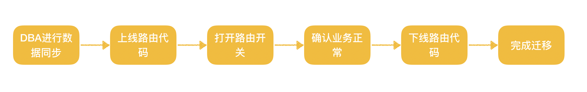
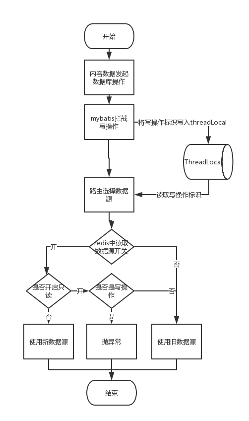

## 背景

原来的业务所有数据库都在一个实例上，配置为8C64G 1TB。由于业务快速增长，在业务高峰期时，数据库QPS大约12k+，频繁出现数据库CPU使用率达到100%的情况。


## 问题分析

短期问题可以通过升级数据库配置解决，但是单机配置有上限，且约往后越不划算，单机的瓶颈会越来越明显，所以需要考虑对数据库进行拆分。


### 水平拆分OR垂直拆分

一般情况下，考虑数据拆分时，分为水平拆分和垂直拆分两个方向。根据经验，水平拆分适合数据量非常大的单表，而垂直拆分适合多个数据表按业务情况拆分到不同的数据库实例中，所以此处选择垂直拆分。


## 实现

### 流程

整体流程参照下图，大致分为五个步骤




#### 数据同步

此处需要DBA配置，创建一个新的数据库实例，并且把需要迁移到新库中的业务表结构与数据进行同步，需要保证旧表与新表的数据是准实时的。一般来说两表的同步时延很短，最多不过几秒钟。


#### 上线/下线路由代码

由于业务逻辑比较简单，此处不引入第三方中间件，通过Sping自带的AbstractRoutingDataSource来实现数据的路由功能，具体实现下文会详细描述。

因为切换的操作是单向的，所以路由功能只需要在操作时使用，如果确定业务正常，则可以下线动态路由功能，改为静态配置选择具体使用的数据源。


#### 路由开关

由于线上机器较多，路由代码上线后不能直接开启，需要有一个开关统一来开启，保证所有机器路由的一致性。


### 关键点


#### 数据源路由


上文提到，动态路由功能可以通过使用Spring提供的动态数据源来实现，即继承AbstractRoutingDataSource类，实现其determineCurrentLookupKey方法，简单看一下这个方法的签名及注释


```java
/**
 * Determine the current lookup key. This will typically be
 * implemented to check a thread-bound transaction context.
 * <p>Allows for arbitrary keys. The returned key needs
 * to match the stored lookup key type, as resolved by the
 * {@link #resolveSpecifiedLookupKey} method.
 */
protected abstract Object determineCurrentLookupKey();
```


在AbstractRoutingDataSource中有一个Map类型的成员变量targetDataSources，其key可以进行自定义，value即为对应的数据源，需要在初始化实例的是往这个map中写入所有动态的数据源，每次有请求数据源的请求时，均会调用determineCurrentLookupKey，需要方法实现中根据情况返回key来选择对应的数据源。

```java
private Map<Object, Object> targetDataSources;
```


有了这个接口，我们需要在其中根据当前数据的请求情况，来判断是走旧库还是新库。而在原来使用数据源的地方，需要修改为这个数据源。


在MyBatis中，可以根据SqlSessionTemplate来隔离两个数据源，前面提到，只需要将一部分业务从原来的数据库中移到新的数据库，那么其中一部分表的访问路径是不变的。所以根据业务情况，将一个SqlSessionTemplate拆成两个。

我们将原来的业务库称为basic库，把新的业务库称为new库，那么SqlSessionTemplate也需要两个，一个是basicSqlSessionTemplate，固定请求原来的数据源；另一个是newSqlSessionTemplate，其请求的数据源需要动态切换的。** 下文我们只讨论需要切换的数据源，两个SqlSessionTemplate的拆分由读者自行实现，本文不再赘述。**


例如项目中使用MyBatis作为ORM，所以在配置SqlSessionTemplate中是这么配置的（本文中的所有代码与配置均为实例，只展示大致的逻辑，不一定是真实可用的）

```xml
<!--原数据库的数据源配置    -->
<bean name="basicDataSource" class="org.apache.commons.dbcp2.BasicDataSource" destroy-method="close">
    <property name="url" value="${url}"/>
    <property name="username" value="${username}"/>
    <property name="password" value="${password}"/>
</bean>
    
<!--需要迁移的业务走这个SqlSessionTemplate    -->
<bean id="newSqlSessionTemplate" class="org.mybatis.spring.SqlSessionTemplate">
    <constructor-arg>
        <bean class="org.mybatis.spring.SqlSessionFactoryBean">
            <property name="dataSource" ref="basicDataSource"/>
            <property name="mapperLocations" value="classpath:mybatis/new/*.xml"/>
            <property name="configLocation" value="classpath:mybatis/sqlMapConfig.xml"/>
        </bean>
    </constructor-arg>
</bean>
```


改造后的数据源配置大致是如下的情况其中com.xxelin.datasource.RoutingDataSource类为我们自己实现的动态数据源类，后文会提供代码。

```xml
<!--原数据库的数据源配置    -->
<bean name="basicDataSource" class="org.apache.commons.dbcp2.BasicDataSource" destroy-method="close">
    <property name="url" value="${url}"/>
    <property name="username" value="${username}"/>
    <property name="password" value="${password}"/>
</bean>
<!--新数据库的数据源配置    -->
<bean name="newDataSource" class="org.apache.commons.dbcp2.BasicDataSource" destroy-method="close">
    <property name="url" value="${url}"/>
    <property name="username" value="${username}"/>
    <property name="password" value="${password}"/>
</bean>
<!--动态数据源-->
<bean id="routingDataSource" class="cn.com.duiba.tuia.news.center.datasource.RoutingDataSource">
    <property name="targetDataSources">
        <map key-type="java.lang.String">
            <!-- 在此处配置需要动态切换的数据库-->
            <entry key="basic" value-ref="basicDataSource"></entry>
            <entry key="new" value-ref="newDataSource"></entry>
        </map>
    </property>
    <!--默认的数据源-->
    <property name="defaultTargetDataSource" ref="basicDataSource"></property>
</bean>

<!--需要迁移的业务走这个SqlSessionTemplate    -->
<bean id="newSqlSessionTemplate" class="org.mybatis.spring.SqlSessionTemplate">
    <constructor-arg>
        <bean class="org.mybatis.spring.SqlSessionFactoryBean">
            <!--注意此处，需要配置成动态数据源routingDataSource-->
            <property name="dataSource" ref="routingDataSource"/>
            <property name="mapperLocations" value="classpath:mybatis/new/*.xml"/>
            <property name="configLocation" value="classpath:mybatis/sqlMapConfig.xml"/>
        </bean>
    </constructor-arg>
</bean>
```


这里补上RoutingDataSource类的代码，这里只作为演示，其中的dynamicSource固定为false，后面会提供动态读取的代码

```java
public class RoutingDataSource extends AbstractRoutingDataSource {

    private static final String DEFAULT_DATA_SOURCE = "basic";
    private static final String NEW_DATA_SOURCE = "new";

    @Override
    protected Object determineCurrentLookupKey() {

        //是否开启动态数据源
        boolean dynamicSource = false;

        if (dynamicSource) {
            //如果开启了，则走新的数据源
            return NEW_DATA_SOURCE;
        }
        //否则走旧的数据源
        return DEFAULT_DATA_SOURCE;

    }
}
```


#### 路由开关

在动态选择数据源时，需要一个统一开关来开启或关闭路由的开关，在此处我选择了使用Redis来作为开关，即每次有请求时，均需要从Redis中读取开关的状态。

这样的优点是简单方便，不用考虑集群间的数据同步；缺点是每个请求都需要去Redis上查询，请求量大时对Redis的压力不小。

读者可以自行根据实际情况选择，例如ZooKeeper、Hazelcast等均可实现此功能。


实现时只需要在Redis（或其他中间件）中存一个开关，一开始默认为空或者默认为关闭状态，在需要切换时，通过系统中暴露一个http接口，手动调用这个http接口来实现开关的开启与关闭。有多种方法能实现类似的操作，请读者自由发挥。

#### 同步时延

前文提到在迁移前，需要DBA进行数据同步，即保持旧库与新库中的数据一致。但是，同步不可避免存在时延，这个时延可能只有几百毫秒，可能长达几秒。如果在这个时延期间，即部分数据写入（泛指一切修改数据的操作）旧库，但是没来得及写入新库前，数据源切换入新库，次数新库的读操作将无法读到部分数据，而写入操作可能会出现主键冲突之类的问题。

所以需要结合自身业务的重要性，考虑是否需要消除同步时延带来的问题。笔者经历过多次数据迁移，在一些非核心且请求量不大的业务中没有考虑这个情况，而一些关键业务需要处理。

解决同步时延方法有多种，这里介绍一下笔者的解决思路，该思路能解决写入操作导致的问题，没有解决延迟读的问题。

这里要处理的问题的原因是数据源已切换成功，但是旧数据可能还没来得及同步到新库，此时的写操作会导致问题写入的数据与稍后同步过来的数据有冲突。那么一个暴力的解决方案就是在切换前让数据库处于只读状态，切换完成一定时间内禁止所有的写操作直到数据同步完成。

这个方案当然也是有问题的，因为会导致线上的写操作出现类似闪断的现象，虽然方案不完美，但是考虑到类似阿里云数据库升级时也同样会出现闪断的现象，而此时所有的读操作是没有影响的，选择在业务低峰期操作，应该是可以接受的。


实现方案可以结合上文路由开关，在开关中再保存一个只读状态，数据结构可以是这样：

```json
{"dynamicSourceSwitch":true,"readOnly":true}
```


整体开关的流程如下图


#### 读写状态的判断

上文提供了一种解决同步时延问题的方案，那么就涉及到如何区分读写操作的问题。

这里提供一种实现方案：使用MyBatis拦截器

MyBatis给开发者提供了拦截器，可以拦截指定的操作，正好可以帮助我们拦截下来所有的写操作。在拦截成功后，可以在ThreadLocal中记录当前SQL操作为写操作，在动态数据源中区分处理。

实现逻辑比较简单，在此处不再赘述，直接贴代码。

```java
@Intercepts({
        @Signature(type = Executor.class, method = "update", args = {MappedStatement.class, Object.class})
})
public class WriteInterceptor implements Interceptor {

    /**
     * 记录当前操作是否为写操作
     */
    public static final ThreadLocal<Boolean> WRITE_HOLDER = new ThreadLocal<>();

    @Override
    public Object intercept(Invocation invocation) throws Throwable {
        //标记当前操作为写操作
        WriteInterceptor.WRITE_HOLDER.set(true);
        return invocation.proceed();
    }

    @Override
    public Object plugin(Object target) {
        return Plugin.wrap(target, this);
    }

    @Override
    public void setProperties(Properties properties) {

    }

}
```


记得在MyBatis配置中添加此拦截器

```xml
<plugin interceptor="com.xxelin.interceptor.WriteInterceptor"/>
```


## 结尾


由于每次访问开关，会带来性能的损耗，如果像笔者一样使用Redis的话，对Redis也有不小的压力，所以在数据源切换完成后，将动态数据源部分代码全部下掉，换回原来固定数据源的方式。


最后贴上真的流程图和一些参考代码，感谢阅读。


### 流程图




### 其余代码

代码仅供参考

```java
public class RoutingDataSource extends AbstractRoutingDataSource {

    /**
     * logger
     */
    private static final Logger LOGGER = LoggerFactory.getLogger(RoutingDataSource.class);


    @Autowired
    private DynamicDataSourceService dynamicDataSourceService;

    private static final String DEFAULT_DATA_SOURCE = "basic";
    private static final String NEW_DATA_SOURCE = "new";

    @Override
    protected Object determineCurrentLookupKey() {

        //是否为写操作
        Boolean isWrite = WriteInterceptor.WRITE_HOLDER.get();
        if (isWrite == null) {
            isWrite = false;
        }
        //配置数据源名称
        String sourceName = DEFAULT_DATA_SOURCE;

        //是否只读
        boolean readOnly = false;
        //是否开启动态数据源
        boolean dynamicSource = false;

        Switch aSwitch = dynamicDataSourceService.getSwitch();
        if (aSwitch != null) {
            readOnly = aSwitch.isReadOnly();
            dynamicSource = aSwitch.isDynamicSourceSwitch();
        }
        //进行切库操作
        if (dynamicSource) {
            //如果是自读状态
            if(readOnly){
                if(isWrite){
                    //写操作时抛出只读异常
                    throw new ReadOnlyException("read only now!");
                }
                //只读状态时继续走老库，此时写操作禁止一段时间
                sourceName = DEFAULT_DATA_SOURCE;
            }else{
                //如果不是只读状态,则切到新库
                sourceName = NEW_DATA_SOURCE;
            }
        }

        LOGGER.info("调用{}库,是否为写操作:{},是否开启动态数据源:{},是否开启只读:{}", sourceName, isWrite, dynamicSource, readOnly);
        return sourceName;
    }
}
```


```java
@Service
public class DynamicDataSourceService {

    /**
     * logger
     */
    private static final Logger LOGGER = LoggerFactory.getLogger(DynamicDataSourceService.class);

    @Autowired
    private StringRedisTemplate stringRedisTemplate;

    public Switch getSwitch() {
        try {
            String value = stringRedisTemplate.opsForValue().get(RedisKeyUtil.dynamicSourceSwitch());
            if (StringUtils.isEmpty(value)) {
                return null;
            }

            return JSON.parseObject(value, Switch.class);
        } catch (Exception e) {
            LOGGER.error("读取数据源开关失败", e);
            return null;
        }
    }
}
```

```java
@RequestMapping("/dds")
@RestController
public class DynamicDataSourceController {

    /**
     * logger
     */
    private static final Logger LOGGER = LoggerFactory.getLogger(DynamicDataSourceController.class);

    @Autowired
    private StringRedisTemplate stringRedisTemplate;

    private static final String KEY = "key";

    @RequestMapping("/open")
    public boolean open() {

        LOGGER.info("-------------------------开启数据源切换------------------------------");
        Switch aswitch = new Switch();
        aswitch.setReadOnly(true);
        aswitch.setDynamicSourceSwitch(true);

        stringRedisTemplate.opsForValue().set(KEY, JSON.toJSONString(aswitch));
        try {
            TimeUnit.MILLISECONDS.sleep(500);
        } catch (InterruptedException e) {
            LOGGER.error("sleep被中断", e);
            close();
            return false;
        }
        LOGGER.info("-------------------------实例只读------------------------------");

        aswitch.setReadOnly(false);
        aswitch.setDynamicSourceSwitch(true);

        stringRedisTemplate.opsForValue().set(KEY, JSON.toJSONString(aswitch));
        LOGGER.info("-------------------------切换实例完毕------------------------------");
        return true;
    }


    @RequestMapping("/close")
    public boolean close() {
        stringRedisTemplate.delete(KEY);
        LOGGER.info("-------------------------关闭数据源切换------------------------------");
        return true;
    }

}
```